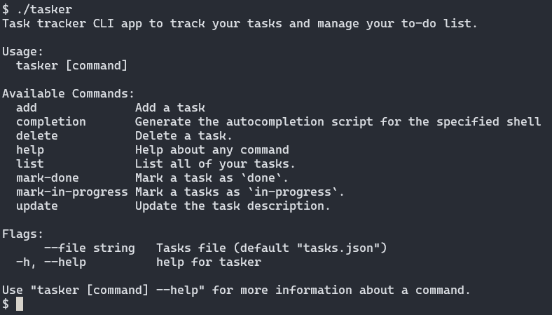

# Tasker

Task tracker CLI app to track your tasks and manage your to-do list.

## Demo



## Build

```bash
# makefile
make build

# directly
go build -o bin/tasker
```

## Tech Stack

Go, Cobra CLI Framework

## Acknowledgements

- [Task Tracker](https://roadmap.sh/projects/task-tracker)
- [Cobra](https://github.com/spf13/cobra)
- [Go](https://go.dev/)
